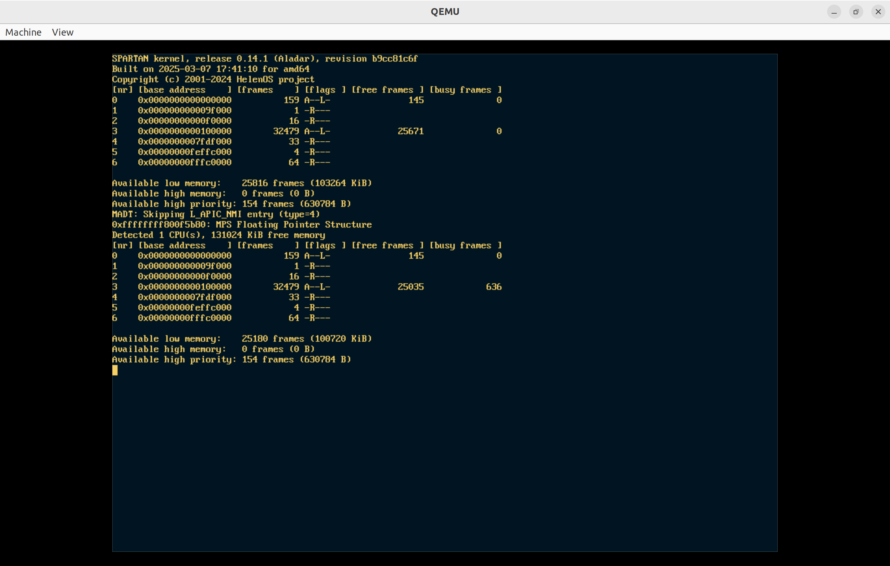
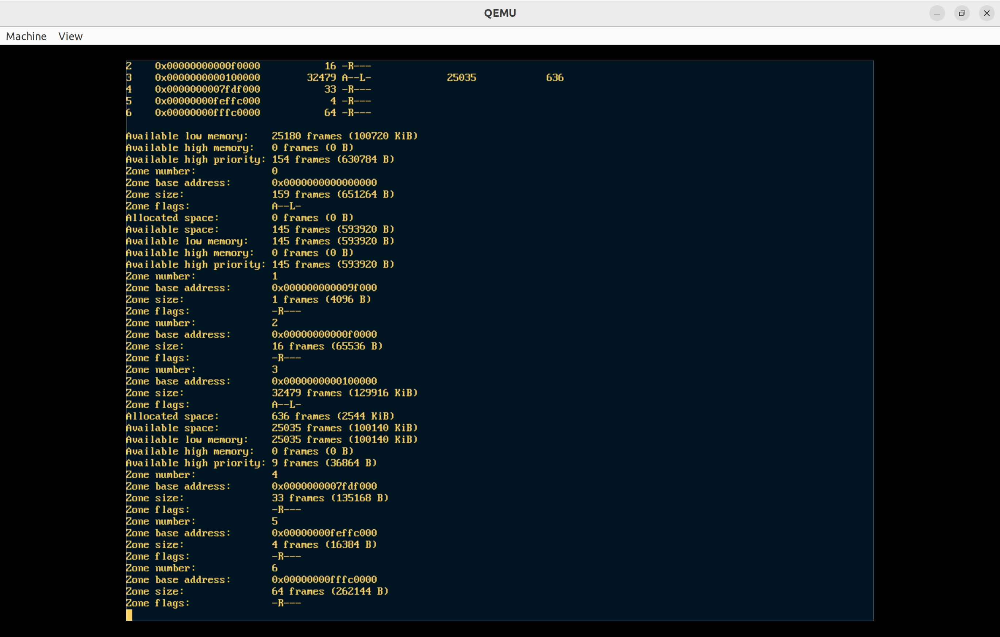
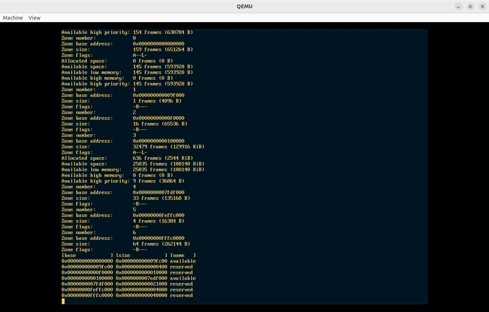

## Helen OS frame init

OS使用的物理内存：




重要的数据结构：全局变量zones中存储的是系统的所以内存区域（物理内存），提供的是分配和回收物理内存的方法。为之后的内存分配器提供支持。
```c
zones_t zones;

typedef struct {
	// 中断自旋锁，用于保护 zones 结构体的访问
	IRQ_SPINLOCK_DECLARE(lock);
	// 系统中内存区域的总数
	size_t count;
	// 一个数组，包含所有内存区域的信息。每个元素是一个 zone_t 结构体，表示一个内存区域。
	zone_t info[ZONES_MAX];
} zones_t;

typedef struct {
	// 该区域中第一个帧的帧号（pfn_t）
	/** Frame_no of the first frame in the frames array */
	pfn_t base;

	// 该区域的大小，即该区域中帧的总数。
	/** Size of zone */
	size_t count;

	// 该区域中空闲帧的数量
	/** Number of free frame_t structures */
	size_t free_count;

	// 该区域中已使用帧的数量
	/** Number of busy frame_t structures */
	size_t busy_count;

	// 该区域的类型标志，用于标识区域的属性（如内存类型、用途等）
	/** Type of the zone */
	zone_flags_t flags;

	// 位图，用于快速检查帧的使用状态。每个位对应一个帧，0 表示空闲，1 表示已使用
	/** Frame bitmap */
	bitmap_t bitmap;

	// 该区域中所有帧的数组，每个帧用 frame_t 结构体表示
	/** Array of frame_t structures in this zone */
	frame_t *frames;
} zone_t;

```
下面是frame模块提供的接口。包括页的分配（frame_alloc）、页的回收（frame_free）、等等。。。
```c
extern void frame_init(void);
extern bool frame_adjust_zone_bounds(bool, uintptr_t *, size_t *);
extern uintptr_t frame_alloc_generic(size_t, frame_flags_t, uintptr_t,
    size_t *);
extern uintptr_t frame_alloc(size_t, frame_flags_t, uintptr_t);
extern void frame_free_generic(uintptr_t, size_t, frame_flags_t);
extern void frame_free(uintptr_t, size_t);
extern void frame_free_noreserve(uintptr_t, size_t);
extern void frame_reference_add(pfn_t);
extern size_t frame_total_free_get(void);

extern size_t find_zone(pfn_t, size_t, size_t);
extern size_t zone_create(pfn_t, size_t, pfn_t, zone_flags_t);
extern void *frame_get_parent(pfn_t, size_t);
extern void frame_set_parent(pfn_t, void *, size_t);
extern void frame_mark_unavailable(pfn_t, size_t);
extern size_t zone_conf_size(size_t);
extern pfn_t zone_external_conf_alloc(size_t);
extern bool zone_merge(size_t, size_t);
extern void zone_merge_all(void);
extern uint64_t zones_total_size(void);
extern void zones_stats(uint64_t *, uint64_t *, uint64_t *, uint64_t *);
```