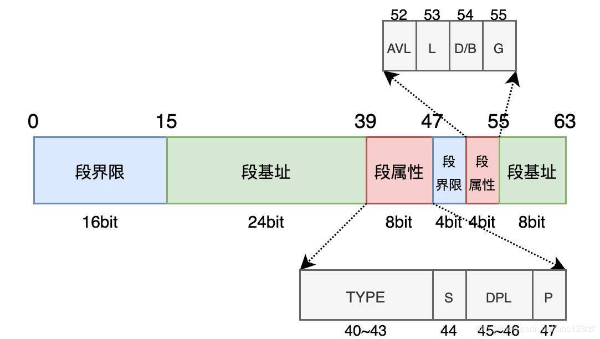

# Global Descriptor Table  全局描述符表
特定于 IA-32 和 x86-64 体系结构的二进制数据结构。它包含告诉 CPU 内存段的条目。

这些体系结构中，有三种这种类型的表：全局描述符表、局部描述符表和中断描述符表（取代中断向量表）。

每个表分别通过 LGDT 、 LLDT 和 LIDT 指令使用其大小和线性地址向 CPU 定义。在几乎所有用例中，这些表只在启动时放入内存中一次，然后在需要时稍后进行编辑。

## 段
具有一致属性的逻辑连续内存块

## 段寄存器
CPU 的寄存器，引用用于特定用途 （CS， DS， SS， ES） 或一般用途 （FS， GS） 的段

## 段选择子
对描述符的引用，您可以将其加载到段寄存器中;选择器是 Descriptor 表中的偏移量，
指向其条目之一。这些条目通常为 8 字节长，因此第 3 位及以上仅声明描述符表条目偏移量，而第 2 位指定此选择器是 GDT 还是 LDT 选择器（LDT - 位设置，GDT - 位清除），
位 0 - 1 声明需要对应于描述符表条目的 DPL 字段的环级别。

## 区段描述符
描述符表中的条目。这些是一种二进制数据结构，告诉 CPU 给定 segment 的属性。

描述符结构（8个字节）：
    

```c
// 8字节大小的GDT描述符
typedef struct {
	unsigned limit_0_15 : 16;
	unsigned base_0_15 : 16;
	unsigned base_16_23 : 8;
	unsigned access : 8;
	unsigned limit_16_19 : 4;
	unsigned available : 1;
	unsigned longmode : 1;
	unsigned special : 1;
	unsigned granularity : 1;
	unsigned base_24_31 : 8;
} __attribute__((packed)) descriptor_t;
```


## GDT
    应该始终在 GDT 中存储这些项目：
        0. 条目 0 或 Null Descriptor 永远不会被处理器引用，并且应始终不包含任何数据。
        1. DPL 0 Code Segment 描述符（您的内核）
        2. 数据段描述符
        3. Task State Segment 分段描述符（至少有一个非常有用）
        4. 如果需要，可以容纳更多细分（例如用户级别、LDT、更多 TSS 等）

HelenOS中的GDT：
```c
[NULL_DES] = {
        0
    }    
```
    段基址： 0x0000 00 0000 
    段界限： 0x0 0000

```c
[KTEXT_DES] = {
		.limit_0_15 = 0xffffU,
		.limit_16_19 = 0xfU,
		.access = AR_PRESENT | AR_CODE | DPL_KERNEL | AR_READABLE,
		.longmode = 1,
		.granularity = 1
}
```
    段基址： 0x0000 00 0000
    段界限： 0xf ffff

    longmode(bit53) = 1 ，L = 1，该属性仅在IA-32e模式下有意义，它标记了该段是否为64位代码段,当L = 1时，该段是64位代码段。
    G = 1，表示段界限的粒度为4KB ， 段限位 0xfffff * 4KB = 4GB。
    0x00 0000  0000 - 0x1 0000 0000
    access(bit 40-47) = 1001 1010 : P = 1 DPL = 00 S = 1 TYPE = 0101(bit 40-43顺序)
        S = 1 ，表示该段是代码段或数据段，TYPE的第三位为1，此处是代码段
        此时，TYPE的0位表示段的访问标记 , 0表示该段未被访问过
            TYPE的1位表示段的读权限，1表示可读、可执行
            TYPE的2位表示一致代码段标记， 0表示不是一致代码段
    
```c
[KDATA_DES] = {
		.limit_0_15 = 0xffffU,
		.limit_16_19 = 0xfU,
		.access = AR_PRESENT | AR_DATA | AR_WRITABLE | DPL_KERNEL,
		.granularity = 1
}
```
    段基址： 0x0000 00 0000
    段界限： 0xf ffff
    
    longmode(bit53) = 0 ，L = 0，该属性仅在IA-32e模式下有意义，它标记了该段是否为64位代码段,当L = 0时，该段不是64位代码段。
    G = 1，表示段界限的粒度为4KB ， 段限位 0xfffff * 4KB = 4GB。
    0x00 0000  0000 - 0x1 0000 0000

    access(bit 40-47) = 1001 0010 : P = 1 DPL = 00 S = 1 TYPE = 0100(bit 40-43顺序) 
        S = 1 ，表示该段是代码段或数据段，TYPE的第三位为0，此处是数据段
        此时，TYPE的0位表示段的访问标记 , 0表示该段未被访问过
            TYPE的1位表示段的写权限，1表示可读可写
            TYPE的2位表示段的增长方向， 0向上增长


```c
[UDATA_DES] = {
		.limit_0_15 = 0xffffU,
		.limit_16_19 = 0xfU,
		.access = AR_PRESENT | AR_DATA | AR_WRITABLE | DPL_USER,
		.special = 1,
		.granularity = 1
	},
```
    段基址： 0x0000 00 0000
    段界限： 0xf ffff

```c
[UTEXT_DES] = {
		.limit_0_15 = 0xffffU,
		.limit_16_19 = 0xfU,
		.access = AR_PRESENT | AR_CODE | DPL_USER,
		.longmode = 1,
		.granularity = 1
	},
```
    段基址： 0x0000 00 0000
    段界限： 0xf ffff

```c
[KTEXT32_DES] = {
		.limit_0_15 = 0xffffU,
		.limit_16_19 = 0xfU,
		.access = AR_PRESENT | AR_CODE | DPL_KERNEL | AR_READABLE,
		.special = 1,
		.granularity = 1
	},
```
    段基址： 0x0000 00 0000
    段界限： 0xf ffff

```c
    [TSS_DES] = {
		0
	},
	[TSS_DES + 1] = {
		0
	},
```
    段基址： 0x0000 00 0000
    段界限： 0xf ffff